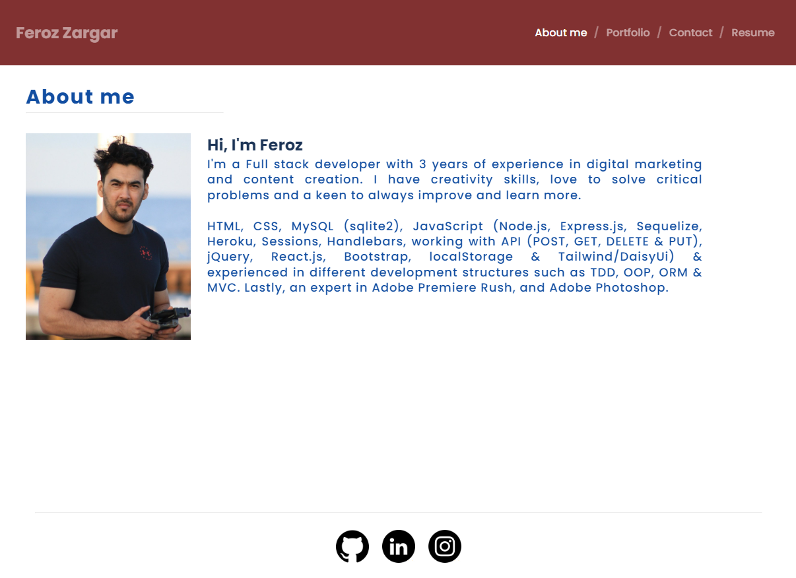
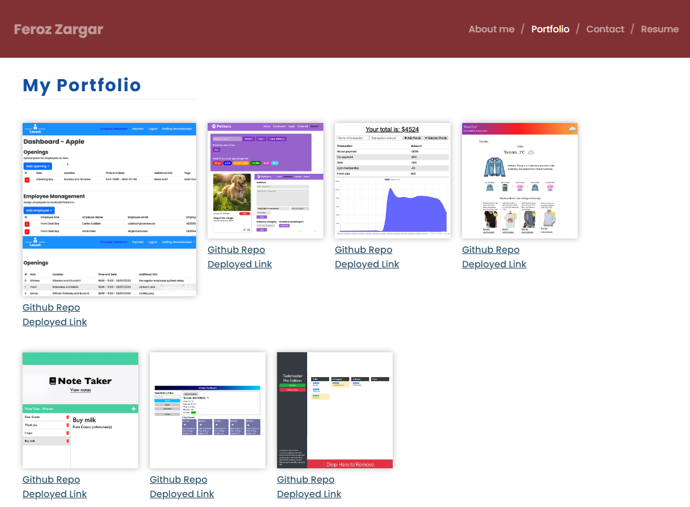
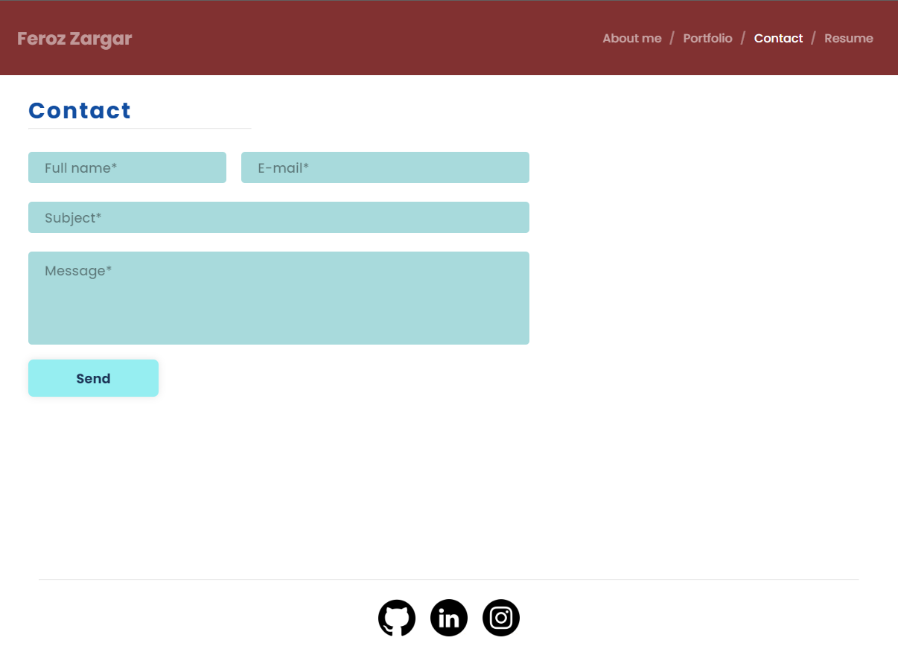
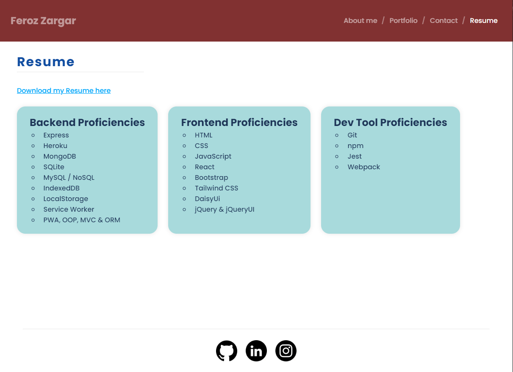

# React-Portfolio

[](https://opensource.org/licenses/MIT)

## Table of Contents

- [Description](#Description)
- [Installation](#Installation)
- [Local Usage](#Local-Usage)
- [Links](#Links)
- [Questions](#Questions)
- [License](#License)

##

## Description

This application was built using the React framework with focus on single page application (SPA) development. There are 4 pages that cover About me, my Portfolio, a Contact section as well as a Resume page with a link to download my resume and a list of my proficiencies. The application is fully responsive and includes multiple JSX / JavaScript functionalities (primarily in the Contact page) to ensure professional-level validation and user experience.

## Installation

1. To install application, clone the main project via the HTTP or SSH link on github.

```
git clone
```

2. Once cloned, open up the project folder in your text editor and run the following command in terminal to install all dependencies.

```
npm install
```

## Local-Usage

Once all dependencies are installed, you can view the application in your local browser by typing in terminal:

```
npm start
```

## Links

[Link to live application](https://falconview.github.io/React-Portfolio/)

## Built With

- React
- Node.js
- JSX / JavaScript
- HTML5
- CSS3

## Questions

[My portfolio](https://falconview.github.io/Portfolio/)

To view my other applications:
[Github](https://github.com/FalconView)

If you have questions about this application or general inquiry, please reach out to me via email: Ferozzargar@hotmail.com

## License

This project is covered under the MIT License.





